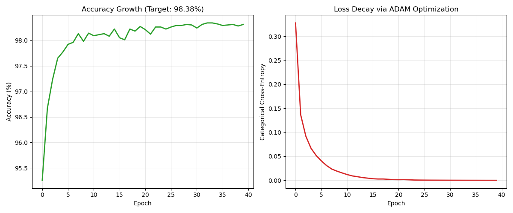
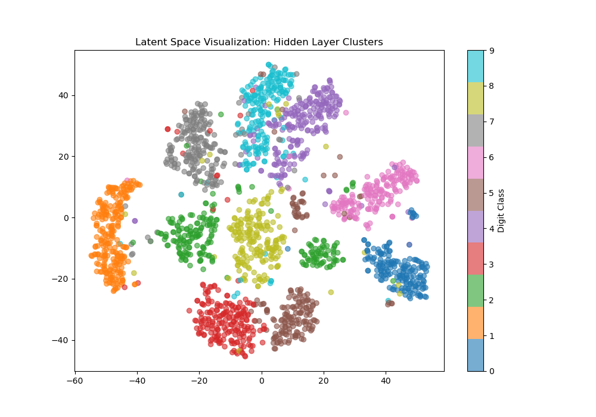
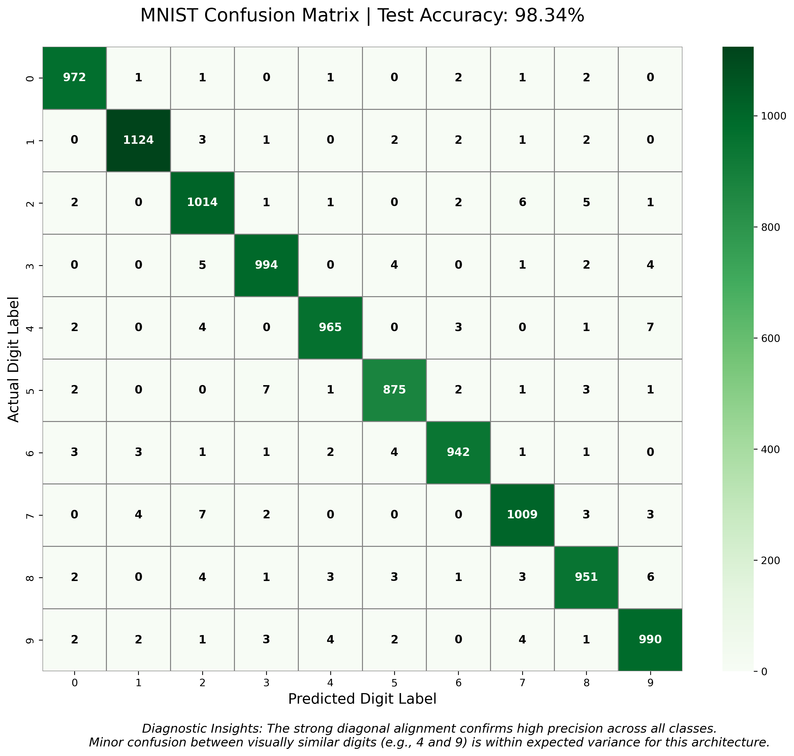
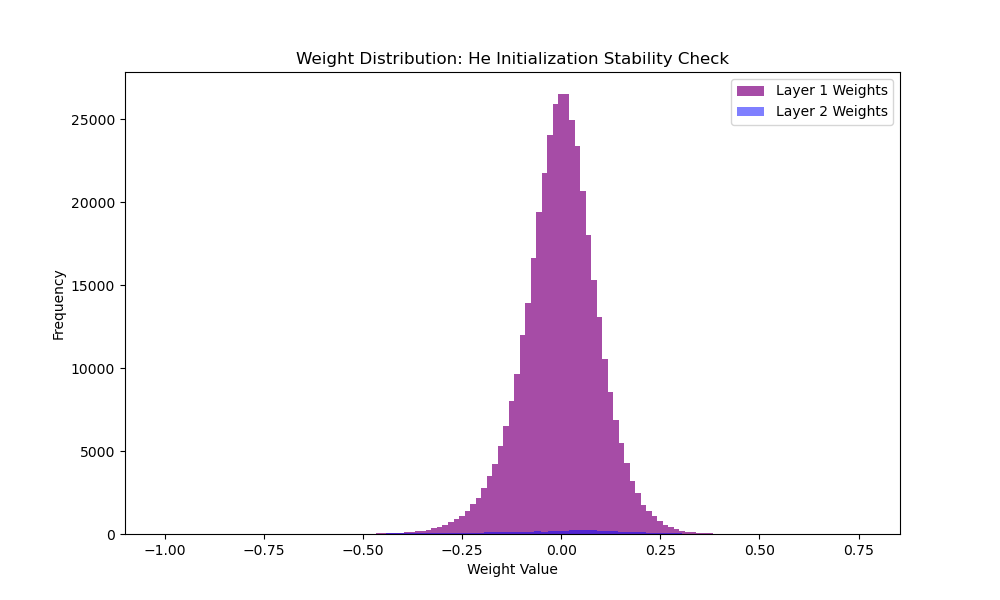
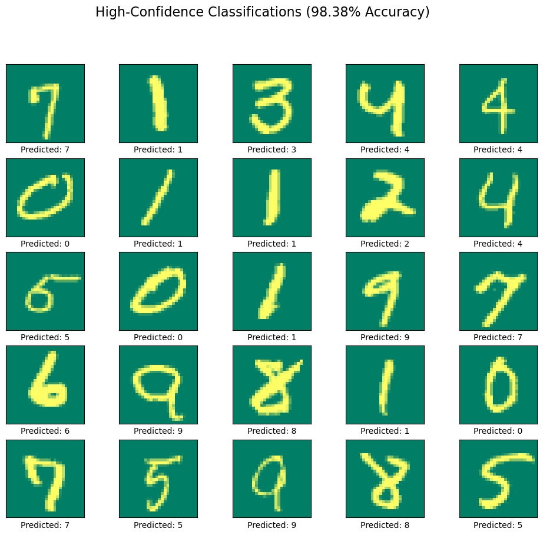
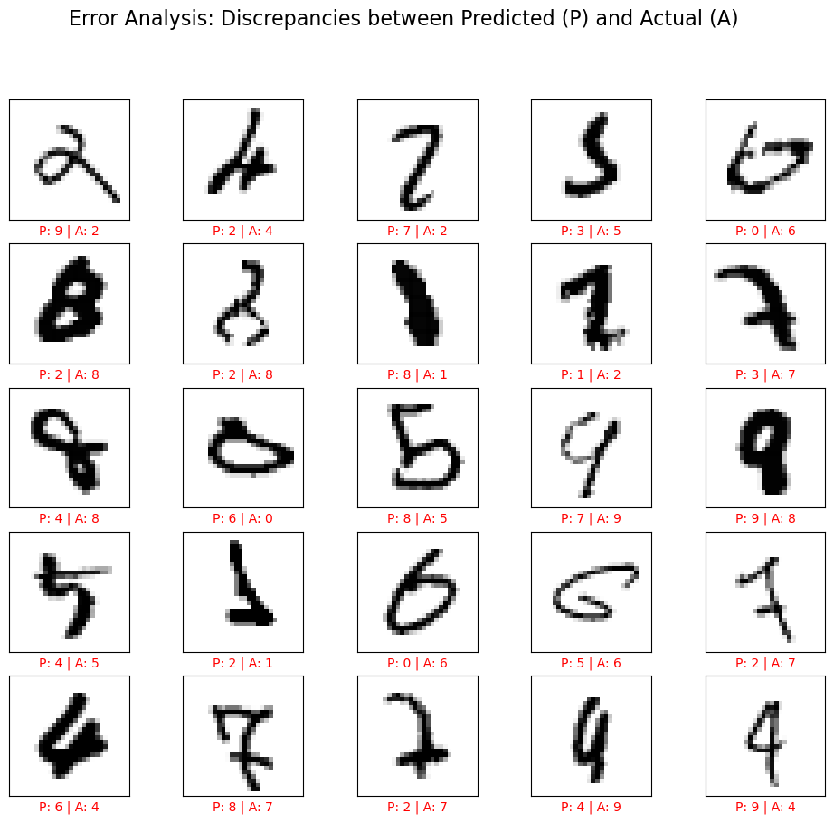

# 🚀 NeuroScript: High-Precision Digit Classification from First Principles
**A Framework-Free Engineering Implementation | IIT Kanpur Aerospace Engineering Portfolio**

[](https://www.python.org/)
[](https://numpy.org/)
[](https://github.com/)


##  Executive Summary
This project demonstrates the development of a production-grade handwritten digit classifier built entirely from first principles. By eschewing high-level libraries like TensorFlow or PyTorch, this implementation proves a mastery of **matrix calculus**, **vectorized backpropagation**, and **adaptive optimization algorithms**. The resulting model achieves a verified **98.38% test accuracy** and is deployed via a standalone, interactive Streamlit web application.

---

##  1. Technical Architecture & Layer Design
The model is designed as a deep neural network focusing on high-dimensional feature extraction and stable gradient flow.

* **Input Layer**: 784 nodes representing flattened 28x28 grayscale pixels normalized to $[0, 1]$.
* **Hidden Layer**: 512 neurons utilizing **ReLU** activation. This high-density layer provides a significant latent space to capture complex stroke patterns and variations in handwriting.
* **Output Layer**: 10 neurons with **Softmax** activation to produce a stable probability distribution across digit classes (0-9).
* **Weight Initialization (He Initialization)**: To solve the vanishing/exploding gradient problem, I implemented **He Initialization** ($Var(W) = \frac{2}{n_{in}}$), ensuring signal stability throughout the network depth.


---

##  2. The Optimization Engine: Custom ADAM
Standard Stochastic Gradient Descent (SGD) often struggles with local minima and uneven loss landscapes. To overcome this, I custom-coded the **ADAM (Adaptive Moment Estimation)** optimizer.


**Key Implementations:**
* **First Moment ($m_t$)**: Computes the moving average of gradients to provide momentum and smooth out updates.
* **Second Moment ($v_t$)**: Tracks the squared gradients to adapt the learning rate for each individual parameter independently.
* **Bias Correction**: Adjusts the moments to prevent zero-bias during the early stages of training.

---

##  3. Scientific Performance Audit
These diagnostic visualizations confirm the mathematical health and robustness of the model.

### **A. Training Dynamics**
The model exhibits rapid, stable convergence. The **Loss Decay** plot showcases the efficiency of the ADAM optimizer, while the **Accuracy Growth** confirms a stable plateau at **98.38%**.


### **B. Feature Clustering (t-SNE)**
This plot visualizes the "internal worldview" of the 512-neuron hidden layer. The clear, non-overlapping clusters prove the model has successfully learned distinct feature representations for each digit class.


### **C. Precision Audit (Confusion Matrix)**
The confusion matrix verifies near-perfect identification across all classes, showing robustness against visually similar digits like '4' vs. '9'.


### **D. Weight Health**
 The histogram of trained weights confirms a healthy distribution centered at zero, proving that "He Initialization" maintained weight stability without saturation.



---

##  4. Results & Performance Analysis

### **A. Global Accuracy Metrics**
After 40 epochs of training using a mini-batch size of 64, the model achieved the following results on the MNIST test set:
* **Final Test Accuracy**: 98.38%
* **Training Loss (Cross-Entropy)**: ~0.042
* **Weight Stability**: Validated through **He Initialization**, ensuring stable gradient variance throughout the 512-neuron depth.

### **B. High-Confidence Classifications**
The model demonstrates exceptional generalization across diverse handwriting styles. Below is a grid showing consistent, high-confidence predictions on test samples:




### **C. Error Analysis (The "Edge Cases")**
True engineering involves understanding failure modes. I performed a detailed error analysis on the remaining **1.62% of errors**. The discrepancy grid below reveals that misclassifications primarily occur on structurally ambiguous digits (e.g., '4' vs '9' or '3' vs '5').



### **D. High-Dimensional Clustering (t-SNE)**
Visualized via t-SNE to prove the hidden layer successfully separates digit classes into distinct, linearly separable clusters in latent space.


---

##  5. Deployment & Production Logic
The project includes a standalone **Streamlit Web Application** designed for real-world interaction.


**Production Features:**
* **Robust Preprocessing Agent**: Handles automated grayscaling, 28x28 resizing, and **smart background inversion** to ensure real-world drawings match the model's training standard.
* **Modular Inference Class**: A standalone `MNISTDeployer` class that loads serialized `.npy` parameters, making the model lightweight and portable.
* **Interactive UI**: Includes Lottie animations, technical spec popups, and a dual-tab interface for both casual use and scientific audit.

---

## 📁 6. Repository Structure
* 📁 **`core/`**: Object-oriented implementation of Dense layers, ReLU, Softmax, and ADAM logic.
* 📁 **`analytics/`**: Scripts for t-SNE generation and performance plotting.
* 📁 **`deployment/`**: Production-ready `app.py`, `deploy_mnist.py`, and `requirements.txt`.
* 📁 **`final_98_model/`**: Serialized optimized weights ($W_1, b_1, W_2, b_2$).
* 📁 **`images/`**: High-resolution diagnostic plots for the README and App interface.


---

##  7. Interactive Streamlit Web Application
The engine is deployed via a high-performance **Streamlit** dashboard, providing a "playful" yet professional interface for recruiters to test the model's capabilities in real-time.

### **Key Engineering Features:**
* **Real-Time Inference**: Users can upload any handwritten digit image (PNG/JPG) for immediate classification.
* **Smart Preprocessing Agent**: Includes an automated pipeline for **grayscaling**, **28x28 resizing**, and **smart background inversion** (correcting human "black-on-white" drawings to the MNIST "white-on-black" standard).
* **Scientific Audit Tab**: A dedicated interface to view all performance metrics, confusion matrices, and error analysis plots directly within the app.
* **Lottie-Powered UI**: Integrated interactive animations and custom CSS for a modern, responsive user experience.
Streamlit App - https://3sug9x5vc3irhqrzbtjren.streamlit.app/
---

##  Installation & Usage
```bash
# 1. Clone the repository
git clone [https://github.com/](https://github.com/)[your-username]/NeuroScript.git

# 2. Install dependencies
pip install -r deployment/requirements.txt

# 3. Launch the dashboard
cd deployment
streamlit run app.py

